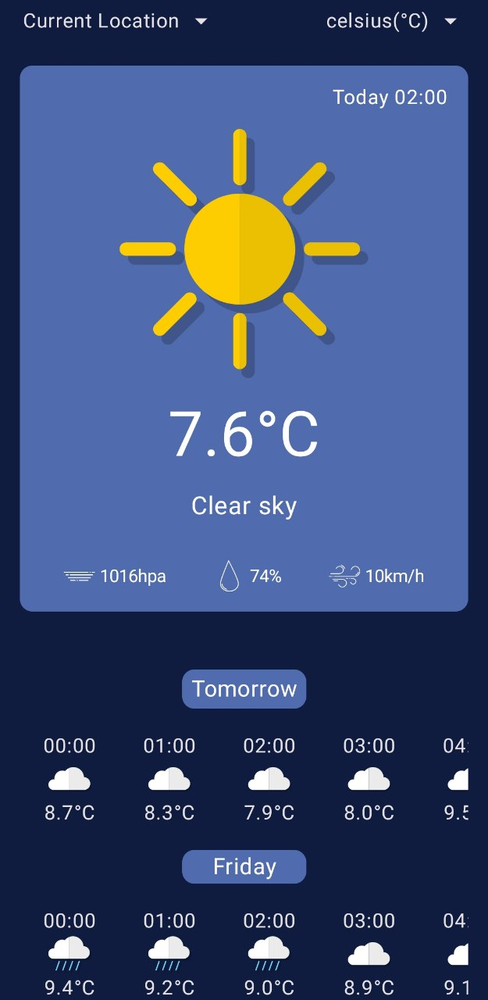

# Nebula-Nook
# Nebula-Nook
Welcome to Nebula Nook Weather, your cosmic gateway to weather exploration! Nebula Nook offers a delightful way to stay informed about the weather, providing a seamless experience for users. With features like location selection, automatic location detection, and the flexibility to choose between Celsius and Fahrenheit, Nebula Nook Weather tailors the weather experience to your preferences. Delve into detailed weather forecasts for the upcoming 5 days and plan your activities with confidence. Nebula Nook's intuitive interface and visually enchanting design make checking the weather a celestial experience.

## Key Features:
- Location selection or automatic detection
- Choice of temperature units (Celsius or Fahrenheit)
- Detailed weather forecast for the next 5 days
- User-friendly and visually captivating design
- Embark on a journey through the atmospheric wonders with Nebula Nook Weather!

## Technologies

- Jetpack Compose
- Retrofit
- Clean Architecture
- Hilt/Dagger2
- MVI
- Location

